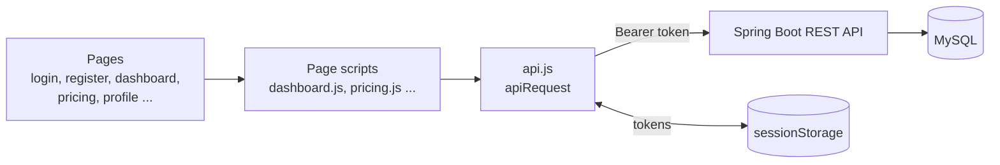
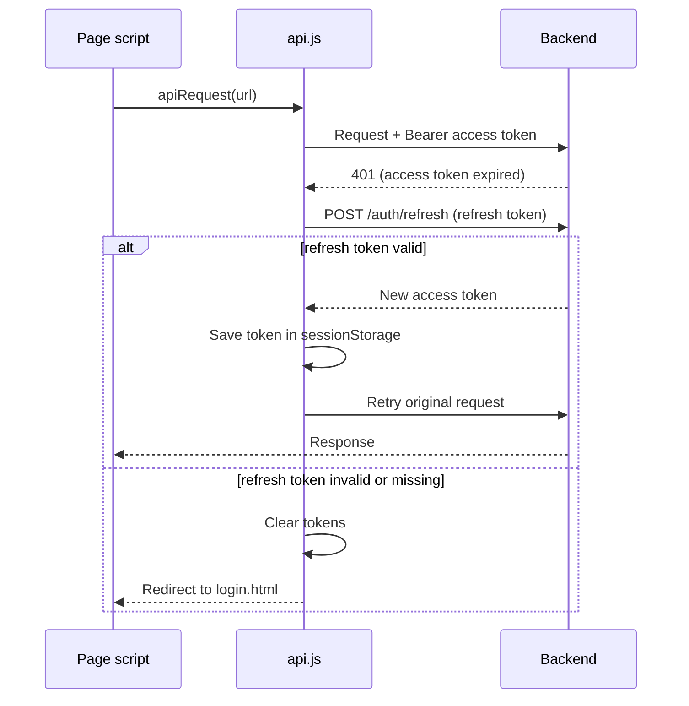
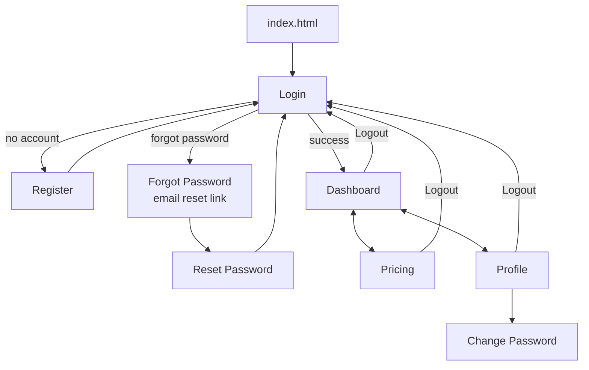
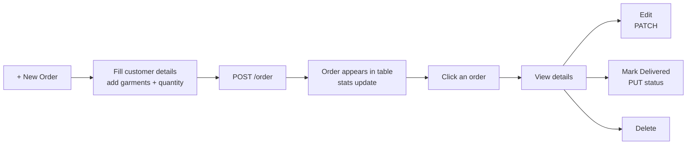

<div align="center">

# 🧺 Laundry Management Frontend

**A clean, responsive web app for laundry shop owners to manage orders, prices and their business profile**


[🌐 Live App](https://laundry-management-frontend-swart.vercel.app) · [⚙️ Backend Repo](https://github.com/dhruvkhurana1626/laundry-management-backend)

</div>

---

## 📌 Overview

The frontend for the **Laundry Management System**. A shop owner can sign up, set prices for each garment type, create and track customer orders, and manage their business profile, all from one dashboard.

Built with **vanilla HTML, CSS and JavaScript**: no framework, no build step. It talks to a Spring Boot REST API using JWT authentication, with **automatic token refresh** so the user is never logged out unexpectedly.

---

## ✨ Features

| | Feature |
|---|---|
| 🔐 | **Register / Login** with show-hide password toggles and inline error messages |
| 🔁 | **Auto token refresh**: an expired access token is silently renewed and the failed request is retried |
| 🔑 | **Forgot, reset and change password** pages |
| 📊 | **Dashboard** with stat cards (Total, Received, Delivered) and a recent-orders table |
| 🔍 | **Search orders** by customer name, phone or email |
| ➕ | **Create orders** in a modal, adding as many garments as needed per order |
| ✏️ | **View, edit, delete and mark delivered** from the order details view |
| 💰 | **Pricing page**: see and update the price for every garment type |
| 👤 | **Profile page**: personal info, business info, PAN / GST, profile photo upload (JPG / PNG, max 5 MB) |
| 📱 | **Responsive design** for desktop and mobile |

---

## 🧰 Tech Stack

| Layer | Technology |
|---|---|
| Markup | HTML5 |
| Styling | CSS3 (separate stylesheet per page) |
| Logic | Vanilla JavaScript (ES6, `fetch`, async/await) |
| Auth storage | `sessionStorage` (access + refresh tokens) |
| Hosting | Vercel (static site) |
| Backend | [Spring Boot REST API](https://github.com/dhruvkhurana1626/laundry-management-backend) |

---

## 🏗️ Architecture

Every page has its own HTML, CSS and JS file. All backend calls go through one shared helper, `api.js`, which attaches the token and handles expiry.



---

## 🔑 Auto Token Refresh



---

## 🧭 App Flow



### 🧾 Order handling on the dashboard



---

## 🗂️ Project Structure

```
├── index.html              Redirects to login
├── login.html              Login
├── register.html           Create account
├── forgot-password.html    Request reset link
├── reset-password.html     Set new password using the emailed token
├── change-password.html    Change password (logged-in)
├── dashboard.html          Orders + stats
├── pricing.html            Garment price list
├── profile.html            Profile + photo
├── css/                    One stylesheet per page
├── js/
│   ├── api.js              Shared fetch wrapper (token + auto refresh)
│   └── *.js                One script per page
└── images/                 Default profile picture
```

---

## ⚙️ Getting Started

### Prerequisites
A running instance of the [backend](https://github.com/dhruvkhurana1626/laundry-management-backend) (Java 21, MySQL).

### 1. Clone
```bash
git clone https://github.com/dhruvkhurana1626/laundry-management-frontend.git
cd laundry-management-frontend
```

### 2. Point it to your backend
Open `js/api.js` and change the base URL:
```js
const API_BASE_URL = "http://localhost:8080";
```

### 3. Serve it on port 3000
There is no build step. Use any static server:
```bash
python -m http.server 3000
# or use the VS Code "Live Server" extension and set its port to 3000
```
Open **http://localhost:3000**

> ⚠️ The backend only allows requests from `localhost:3000`, `127.0.0.1:3000` and the Vercel domain (CORS). If you serve the app on another port, add it in the backend's `SecurityConfig`.

### 4. Deploy
Push to GitHub and import the repo in **Vercel**. It is a static site, so no build settings are needed.

---

## 🧪 Quick Test Flow

1. Register a new account, then log in.
2. Open **Pricing** and change the price of a garment.
3. On the **Dashboard**, click **+ New Order**, add a customer and a few garments.
4. Open the order, edit it, then mark it as **Delivered**.
5. Open **Profile**, fill in business details and upload a photo.

---

## 🚀 Future Improvements
- Show the monthly revenue and order stats from the backend `/dashboard` API
- Pagination and status / date filters on the orders table
- Move to React for reusable components
- Loading skeletons and toast notifications

---

## 👤 Author

**Dhruv Khurana**
[GitHub](https://github.com/dhruvkhurana1626)
